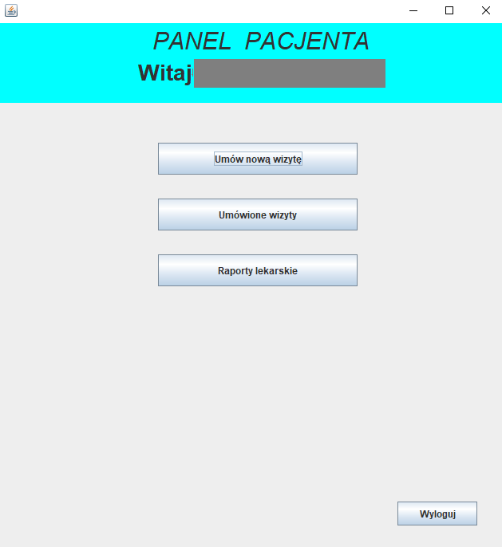
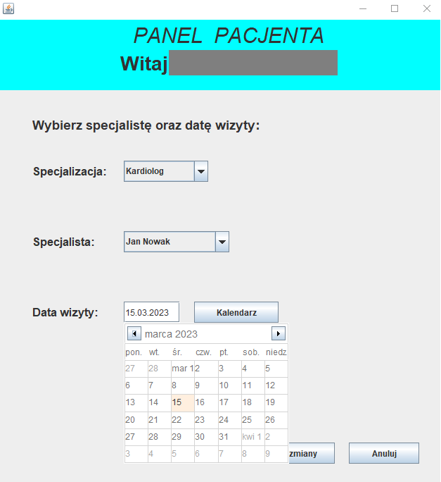
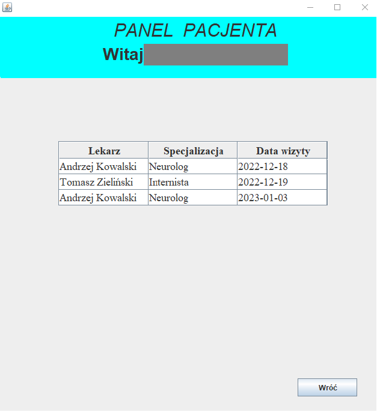
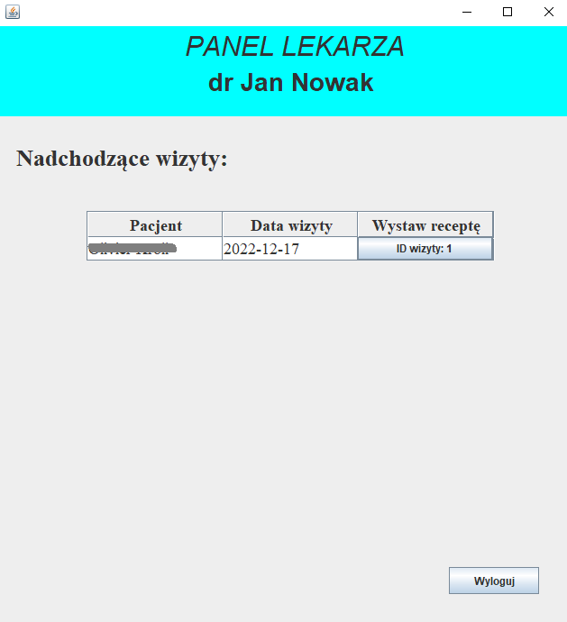
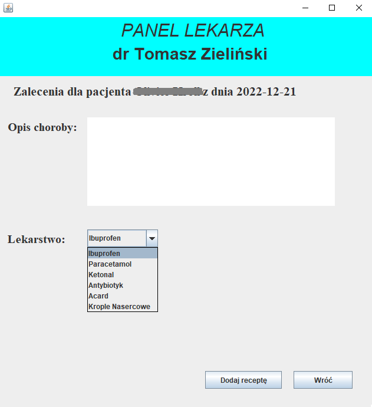

<h1>
Hospital Managment System in Java
</h1>
<h2>
Oracle Database
</h2>
<h3>
PL
</h3>

The application was created to manage hospital patients. It supports the patient's panel and the doctor's as well. 
Patients have the option of making appointments with doctors of the selected specialization at a specific time. In addition, they can see their recommendations and prescriptions after the visit.
Doctors see a list of their appointments. After the visit begins, they issue a prescription.

## Login panel

## Patient menu

## Registration for a visit

## Patient visit list

## Doctor menu with lists of appointments

## Issuing a prescription

